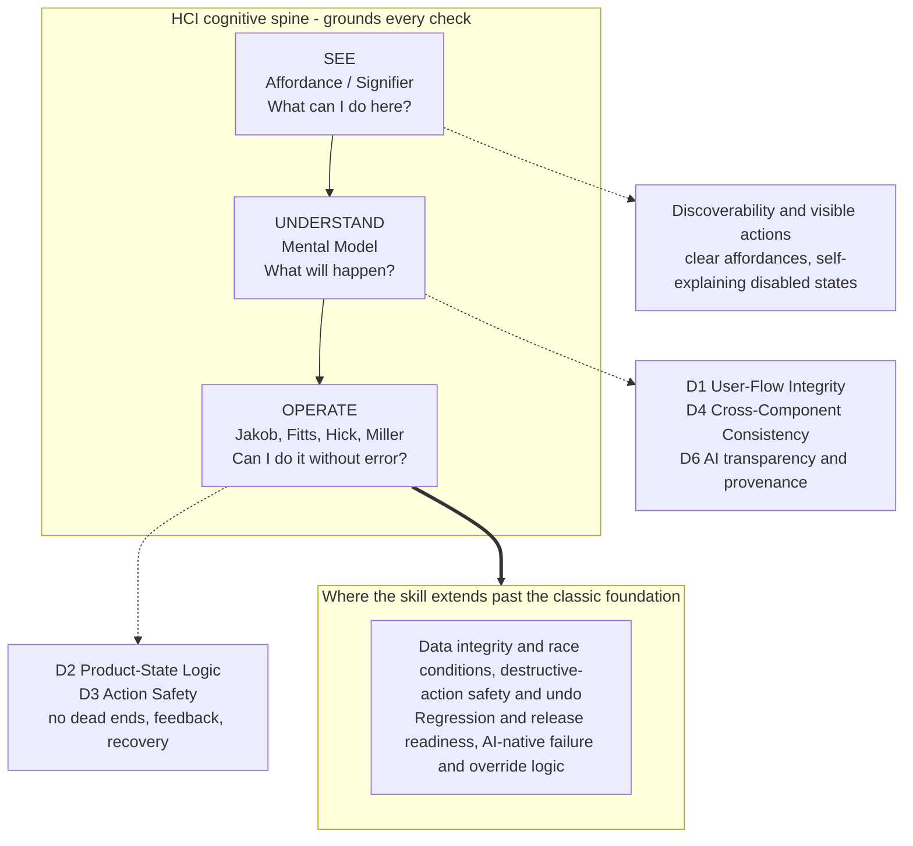

# Interaction Intelligence Audit

**A coding-agent-agnostic workflow for auditing and remediating interaction logic, user-flow integrity, product-state failures, and AI-native interaction risks.**

> **This skill focuses on how a product behaves, not how it looks.**

It is **logic-first**: it detects and remediates **behavioral failures** — issues affecting task completion, data integrity, recoverability, trust, and release readiness — and returns a severity-ordered, evidence-based report you can take straight into sprint planning.

It runs on any repository-capable coding agent ([Claude Code](https://claude.com/claude-code), OpenAI Codex, Cursor, Windsurf, Gemini CLI, GitHub Copilot, and equivalents), because it relies only on generic repository operations and Markdown instructions.

## Modes

- **A — One-shot Audit** *(default)*: walk the framework, return one severity-ordered report ([OUTPUT_TEMPLATE.md](OUTPUT_TEMPLATE.md)). Nothing is written unless you ask.
- **B — Persistent Remediation**: audit *and* fix issues **one at a time under human review**, with an append-only history (`AUDIT_BUGS.md` / `changelog.md` / decision log) **inside the target repo**. Fix one → stop → await review → continue.
- **C — Regression Re-Audit**: compare current behavior against the repo's historical records; report reopened issues, new regressions, still-open / verified-closed issues, and violated decisions. Logs regressions as new entries.
- **D — Targeted Runtime-Assisted Flow Audit**: validate **one named flow** using the strongest available runtime evidence (dev server, E2E suite, browser, screenshots), falling back to flagged static inference.
- **E — Scoped Static Flow Audit**: statically analyze **one named flow** in a large repo without runtime access, inspecting only relevant files to cut context overload and false positives.

In Modes B–E, **all records are created inside the target repo — never inside this skill repo** (a mandatory preflight confirms this). Details: [WORKFLOW.md](WORKFLOW.md); scaffolds: [templates/](templates/).

---

## What This Skill Audits

Logic-first, organized as seven primary domains (Tier 1), with conditional secondary checks (Tier 2). Full actionable framework: [CHECKLIST.md](CHECKLIST.md) (sections `01`–`23`).

**Tier 1 — Primary Logic Audit (always in scope):**

1. **User-Flow Integrity** — broken workflows, dead ends, unclear next actions, missing back-navigation, lost progress, invalid transitions, abandonment risk.
2. **Product-State Logic** — loading / empty / error / success / partial-success / retry / disabled / stale states; optimistic updates and rollback; refresh / session recovery; cross-page state sync.
3. **Action Safety & Data Integrity** — duplicate submission, silent mutations, destructive actions without confirmation, missing undo, data loss, late validation, race conditions.
4. **Cross-Page & Cross-Component Consistency** — equivalent actions behaving consistently: outcomes, validation, save / retry / navigation / permission behavior, object status.
5. **Permissions & Access Control** — inaccessible actions still appearing actionable, missing explanations, authorization failure without recovery, inconsistent role behavior.
6. **AI-Native Interaction Logic** *(first-class)* — processing / progress states, failure recovery, context loss, provenance / confidence, generated-vs-verified distinction, human override, multi-agent coordination, auditability.
7. **Regression & Release Readiness** — reopened failures, reappearing bugs, violated decisions, incompatible cross-flow changes, release-blocking risks, migration state failures.

**Tier 2 — Conditional / Secondary** (audited only when an issue causes functional, accessibility, comprehension, data-integrity, or workflow-safety impact): Motion, Accessibility, Responsive Design, Internationalization, Analytics, Performance, Security & Privacy.

---

## Theoretical grounding: See → Understand → Operate

The framework is anchored to a classic HCI cognitive chain — a user must first **see** what is actionable, then **understand** what will happen, then **operate** without error. Each stage maps to established design theory, and the audit domains hang off that spine:

- **See — Affordance / Signifier** — *"What can I do here?"* discoverability, clear affordances, self-explaining disabled/loading states.
- **Understand — Mental Model** — *"What will happen?"* navigation predictability, labels matching how users think, consistent behavior, AI provenance.
- **Operate — Jakob · Fitts · Hick · Miller** — *"Can I do it without error?"* familiar patterns, no needless steps, perceptible feedback, dead-end-free flows, recoverable failures.

The skill is **grounded in this foundation but deliberately extends past it** — into data integrity, destructive-action safety, regression/release readiness, and AI-native failure logic. It does **not** treat Fitts/Hick as visual-polish checks; it reports them only where they cause a behavioral failure.



---

## What This Skill Does Not Audit

This skill is **not** a visual-design review tool. It does **not** evaluate visual aesthetics, brand styling, color quality, typography taste, spacing polish, illustration/icon style, visual-trend alignment, or pixel-perfect craftsmanship.

Visual observations are reported **only** when they cause a measurable functional, accessibility, comprehension, or workflow problem — and then as *that* problem, not as an aesthetic note:

```text
Not: "The button color is not visually polished."
But: "The primary action has insufficient contrast, making it hard to
      identify and increasing task-completion risk."
```

---

## Setup

The skill is just Markdown + generic repository operations, so any repository-capable agent can run it.

```bash
git clone https://github.com/SheenLiu0106/interaction-intelligence-audit.git
```

**Universal fallback (works with any agent):** give the agent [`PROMPT.md`](PROMPT.md), or tell it to read [`SKILL.md`](SKILL.md), [`WORKFLOW.md`](WORKFLOW.md) (for Mode B), and the relevant [`templates/`](templates/). This depends on no vendor-specific feature and is the recommended default.

**Agent-specific integration** (illustrative — confirm against your agent's current docs):

| Agent | Example integration path |
|---|---|
| **Claude Code** | Clone into a skills directory (e.g. `~/.claude/skills/…`); restart after first install. |
| **OpenAI Codex** | Reference `SKILL.md` / `WORKFLOW.md` from an `AGENTS.md`-style file. |
| **Cursor / Windsurf** | Add the folder to the workspace; reference from a project rule. |
| **Gemini CLI** | Reference the files from a context file (e.g. `GEMINI.md`). |
| **GitHub Copilot** | Reference from a repo-level instructions file (e.g. under `.github/`). |

The frontmatter in `SKILL.md` is optional metadata used only by some agents for auto-discovery; others read it as plain instructions.

---

## Usage

Describe what to audit and which mode you want. Mode A can start from a surface, URL, screenshots, design frames, or a step-by-step flow. Deeper validation may need repository access, runtime inspection, or manual verification.

**Mode A — report only:**

```text
Run the Interaction Intelligence Audit (SKILL.md / PROMPT.md) on this project.
Start with the primary user journey. Do not modify code.
Produce an evidence-based report ranked by severity, per OUTPUT_TEMPLATE.md.
```

**Mode B — audit and fix under review:**

```text
Run the Interaction Intelligence Audit in Persistent Remediation mode (WORKFLOW.md).
Confirm the target repo (not the skill repo), scaffold AUDIT_BUGS.md / changelog.md from
templates/, record findings, fix only the highest-priority issue, stop, and wait for review.
```

See [PROMPT.md](PROMPT.md) for full fill-in templates (including Mode C) and audit personas.

---

## Output Format

- **Mode A** — one structured report ([OUTPUT_TEMPLATE.md](OUTPUT_TEMPLATE.md)), findings grouped by severity (Critical → High → Medium → Low). Each finding names a concrete state/flow/component/screen and follows Issue / Severity / Impact / Recommendation. Also includes an Executive Summary (top risks + optional risk score), category-level risk indicators, and a Recommended Next Sprint (Priority 1/2/3).
- **Mode B** — persistent remediation records inside the target repo (`AUDIT_BUGS.md`, `changelog.md`, decision history).
- **Mode C** — a regression report; new regressions logged as entries referencing the original issue IDs.

Worked examples (logic-first and per-product-type): [EXAMPLES.md](EXAMPLES.md).

---

## AI-native product coverage

When the target is an AI or agent product, the dedicated **AI-Native Interaction Logic** domain becomes primary scope:

- **Transparency** — what the AI is doing; whether output was generated, retrieved, inferred, or entered.
- **Confidence & evidence** — uncertainty signals, citations, verifiable sources.
- **Failure recovery** — retry / regenerate / edit; distinguishing model vs. tool vs. data failures; protecting work.
- **Human override** — editing, rejecting, approving, intervening before irreversible actions.
- **Multi-agent coordination** — roles, handoffs, task status and ownership.
- **Memory & context** — what context is in use; whether users can inspect, edit, or reset it.
- **Trust & auditability** — explainability, audit trails, traceability to sources and tools.

---

## Evidence classification

Every finding states **how it was identified and how strongly it is verified**, so you can tell a confirmed defect from a hypothesis. Evidence is **append-only and multi-stage** — a finding can progress `Static Inference → Runtime Observed → Test Verified → Human Verified`. A static-only finding uses cautious language and is **never** presented as confirmed runtime fact. Field definitions: [WORKFLOW.md](WORKFLOW.md) / [OUTPUT_TEMPLATE.md](OUTPUT_TEMPLATE.md).

## Audit profiles

Pick a profile at intake — **MVP**, **Production**, or **High-Risk / Regulated** — to tune severity, recommendation depth, and timing. **Default: Production.** Findings also carry **Risk if Unfixed**, **Implementation Effort**, and **Recommended Timing**, prioritized by probability, user impact, stage, data-integrity risk, and recovery difficulty. Details: [SKILL.md](SKILL.md) / [WORKFLOW.md](WORKFLOW.md).

## Runtime-aware validation & limitations

**Static inspection is the minimum, not the maximum.** The skill uses the strongest validation the agent environment allows — inspect code, run validation commands, start a dev server, use existing browser/E2E tooling — and clearly distinguishes inference from verified behavior. It **never** claims runtime verification unless it actually performed it.

It ships **no** built-in browser runner, E2E framework, or usability harness, and **complements rather than replaces** runtime E2E testing, accessibility validation, visual QA, and human usability review. Procedures and report schemas: [WORKFLOW.md](WORKFLOW.md).

**Optional Playwright / runtime enhancement.** Mode D is the only mode that benefits from browser automation. If a Playwright install (or a configured Playwright MCP / browser agent), an existing E2E suite, or a runnable dev server is present in the environment, Mode D **detects and uses it automatically** to upgrade findings toward `Runtime Observed` / `Test Verified`. None of this is a dependency: it is **opt-in capability detection**, not a required pairing. With no runtime tooling, Mode D degrades gracefully to static inference flagged `Runtime Verification Recommended`. To enable browser validation where it is wanted: `npx playwright install` — the skill installs no new dependencies on its own without explicit approval.

---

## Contributing

Contributions welcome — especially checklist improvements, example findings, and missing audit dimensions. See [CONTRIBUTING.md](CONTRIBUTING.md).

## License

Released under the [MIT License](LICENSE).
